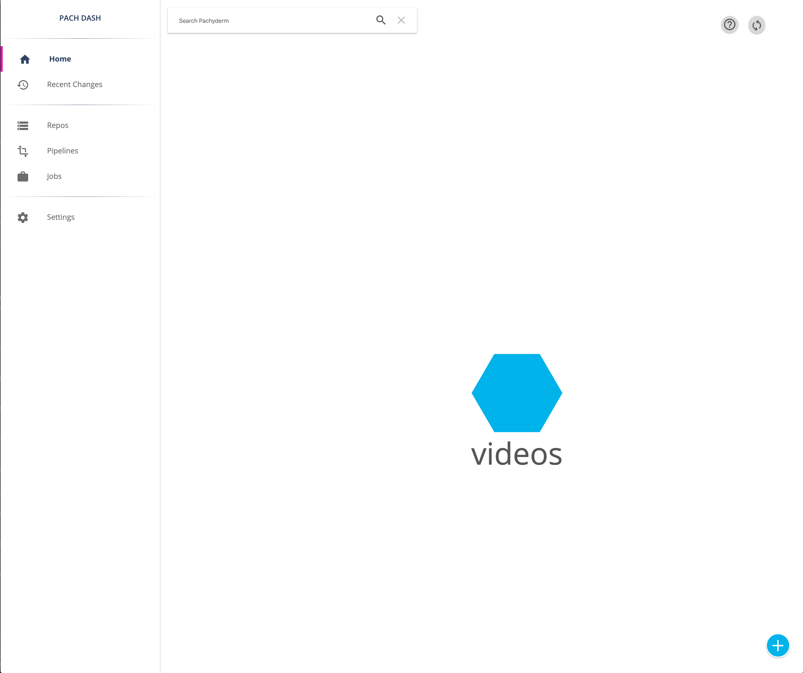
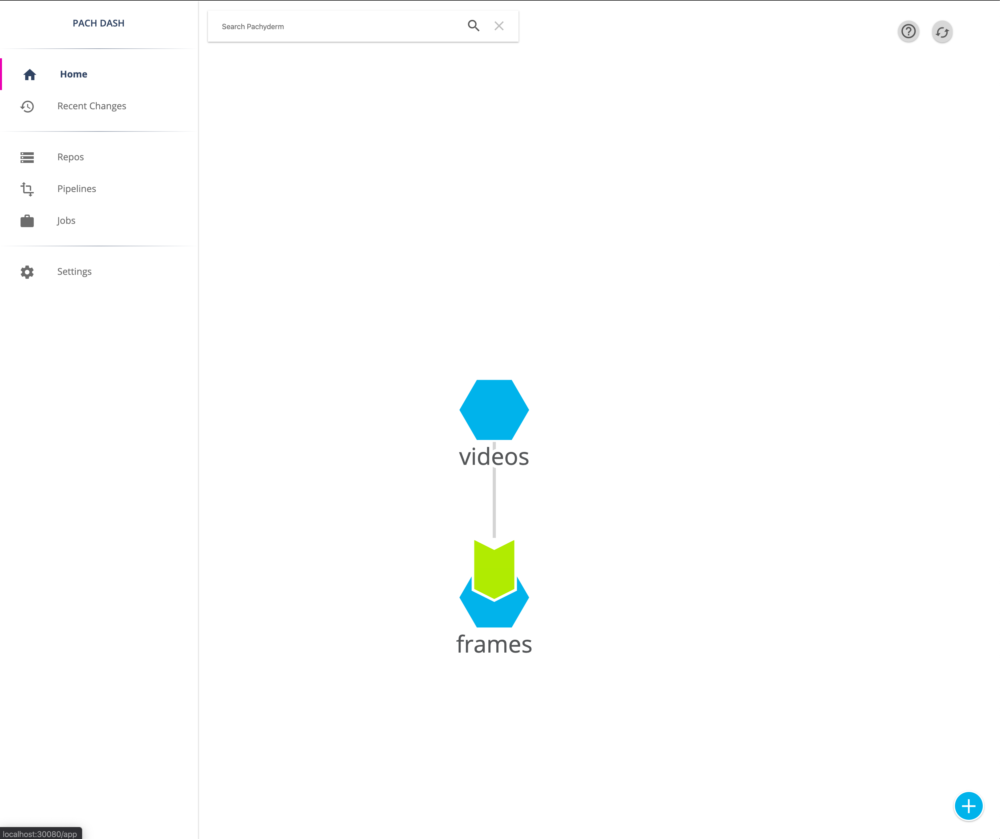

## Video Processing Using Py3, OpenCV, and Pachyderm

Pachyderm can run locally on your computer (I recommend having at least 8 GB of RAM), self-hosted in a cloud environment, or through the hosted [Pachyderm Hub solution](https://hub.pachyderm.com/). 

To install Pachyderm locally, head to the [Getting Started page](https://pachyderm.io/getting-started/) and follow the instructions for your operating system. To verify that everything is setup correctly, run the following command in your command line and you should see a version number.

```
pachctl version
```

Then, run the following commands to view the GUI for Pachyderm in your browser.

```
pachctl deploy local
pachctl port-forward
```

If everything was setup correctly, you can access the Pachyderm Dashboard by navigating to [http://localhost:30080/](http://localhost:30080/). 

Note that you may be asked to input your email and register to access this Dashboard locally.

## Adding Data

Once you have Pachyderm setup, clone the following Github repo to your computer.

```
git clone https://github.com/srinify/replay_analysis.git
```

After cloning, navigate into the repo using `cd`.

```
cd replay_analysis
```

We'll start by creating a **repo** for our gameplay videos. You can think of a repo as a version controlled folder for your data. You can add new gameplay videos to the repo and your pipeline code will automatically re-run over just the new files.


```
pachctl create repo videos
```

If you navigate to your Pachyderm Dashboard, you should see your repo listed.



Then, add a video to this repo in the `master` branch.  We've included the first 10 seconds of a Halo 5 match as an example for testing in this repo.

```
pachctl commit videos@master -f first_ten_seconds.mp4
```

You can view the file in the Dashboard.


## Adding A Pipeline

Let's look at what else is in this repo:

- `frames.py`: this contains the first step of our pipeline code, which splits each video into frames and writes out each image file.
- `Dockerfile`: this specifies the build process for our Docker container. 
	- You'll notice that we use a pre-built Docker image with the libraries we need as the base and then inject `frames.py`.
- `frames.json`: this is a Pachyderm specific configuration file that tells the system how to run our pipeline. You can read more about the pipeline spec [here](https://docs.pachyderm.com/latest/reference/pipeline_spec/).

In Pachyderm, we run code by creating a **pipeline** and specifying the repo that acts as in the input data for that pipeline. Because `frames.json` specifies the information needed to run the pipeline (including information on what input data repo to use), we just need to piont to this file when creating a pipeline.

```
pachctl create pipeline -f frames.json
```

You'll now see this pipeline in the Dashboard.



## Running The Pipeline

To run the pipeline code against the ten second video game clip, use the `pachctl create pipeline` command and specify the JSON configuration file.

```
pachctl create pipeline -f frames.json
```

Note that Pachyderm will use the `videos` repo for the input data and will write out any results to the `frames` repo.

You can check the pipeline status using:

```
pachctl list pipeline
```

To actually run the pipeline over the new data, Pachyderm creates a [job](https://docs.pachyderm.com/latest/concepts/pipeline-concepts/job/). You can check the status of the job associated with the data you just added by running:

```
pachctl list job
```

Once the job has successfully completed, you can view the output folder in the local Pachyderm Dashboard. 

If either your pipeline or job failed, use the following guide to debug: [Pipeline Troublshooting](https://docs.pachyderm.com/latest/troubleshooting/pipeline_troubleshooting/). We also encourage you to join the [Pachyderm Slack channel](https://slack.pachyderm.io/) if you need more help or want to ask any questions.

If you want to run this pipeline on a full Halo 5 match, you can add a new data commit that fetches the video for a full match from Google Cloud.

```
pachctl put file videos@master:jan1_2020_game_1.mp4 -f https://storage.googleapis.com/halo_videos/jan1_2020_game_1.mp4
```

Once the file is downloaded and added, Pachyderm will detect the changes to the `videos` repo and re-run the pipeline.