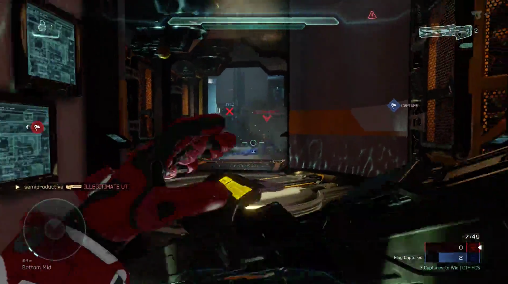
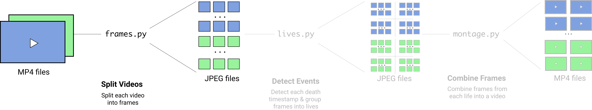
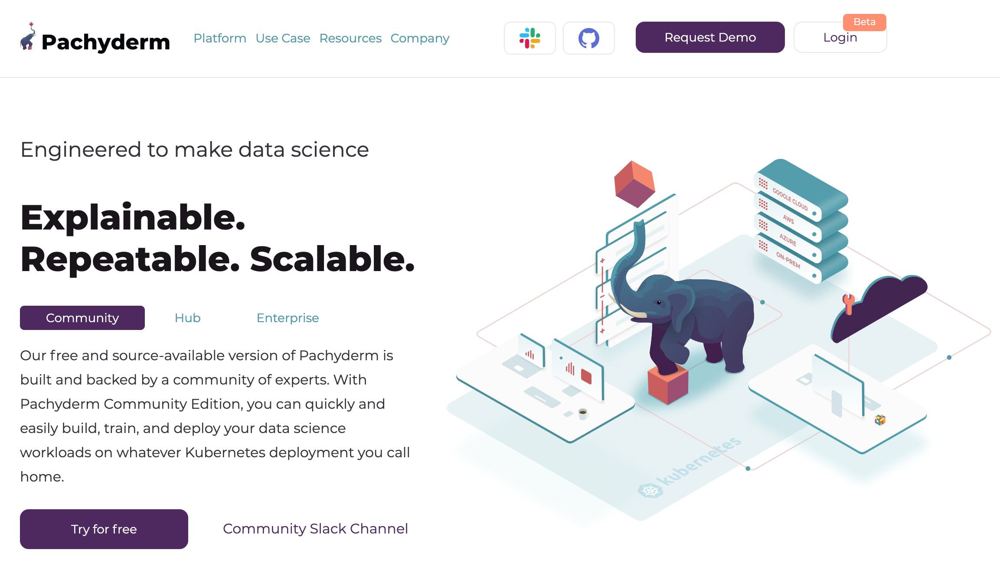
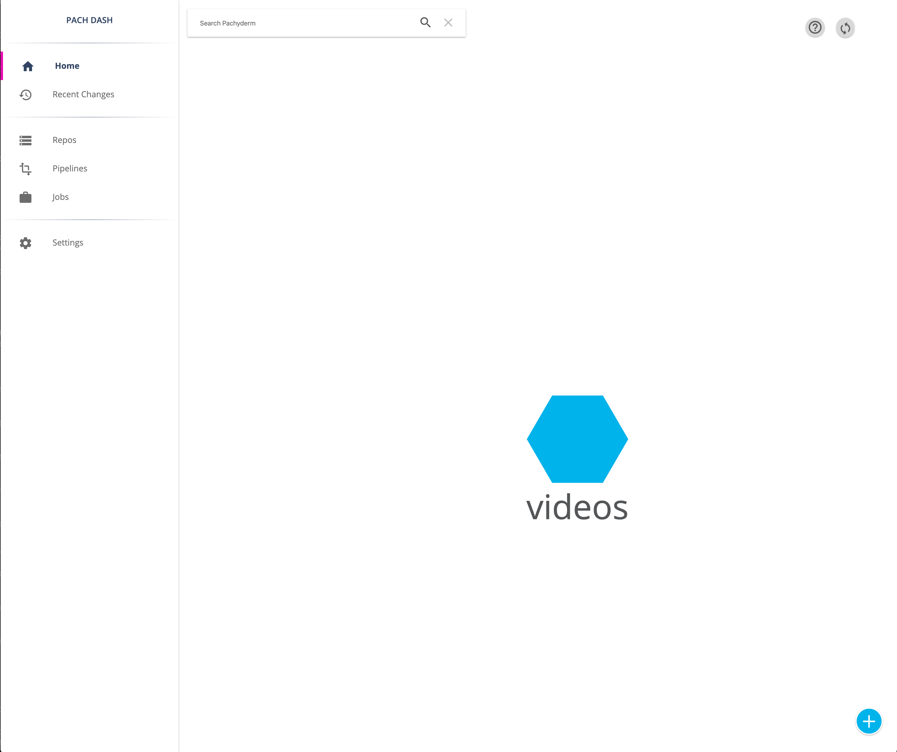
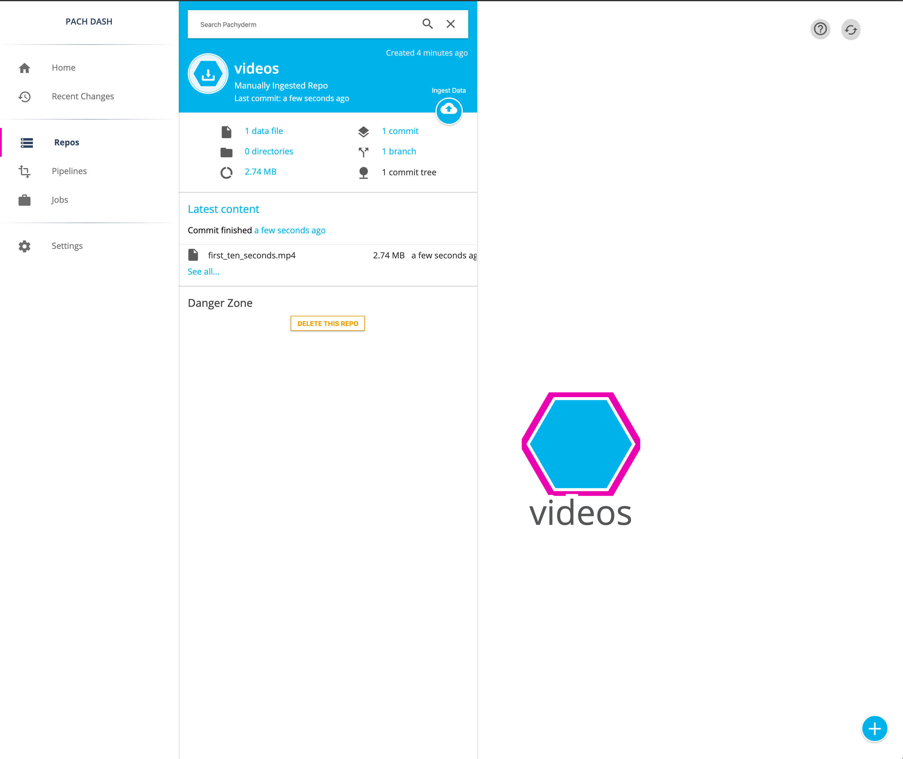
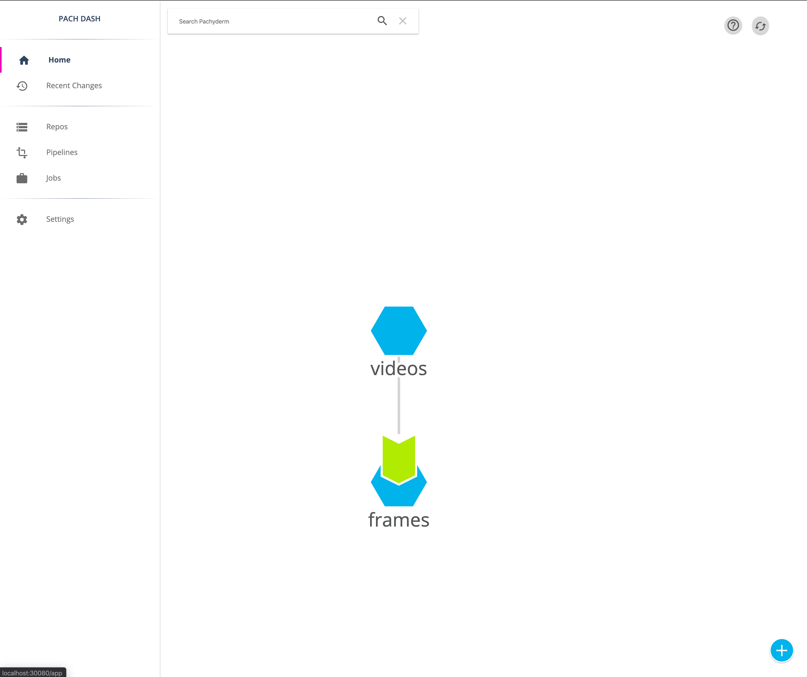

## Use Python and Computer Vision To Help You Improve Your Video Game Skills

Fornite, PUBG, League of Legends, Overwatch, Counter Strike, Call of Duty. 

You may have heard of or played these immensely popular multiplayer games. While all of these games are well known for their popularity, they're also known for having rich, competitive scenes. The League of Legends World Championship from late 2019 brought together over 20 different international teams to compete for a million dollar prize pool.


While only a few hundred players and their teams qualify for these large championships, many thousands more make a living streaming their skilled gameplay on major streaming platforms like Amazon's Twitch.tv and Microsoft's Mixer.

All of this leads to a natural question: what separates the average, casual gamer from the professional Esports player?

**Deliberate Practice**. And lots of it.

But don't take our word for it. Ask Ninja, one of the most [successful video game streamers](https://www.businessinsider.com/ninja-tyler-blevins-twitch-subscribers-fortnite-drake-youtube-2018-3) and a [former competitive Halo player](https://www.esportspedia.com/halo/Ninja). The following exercept is from an [ESPN feature story on Ninja](http://www.espn.com/espn/feature/story/_/id/24710688/fortnite-legend-ninja-living-stream):

> How does he stay so good? **Pro tip: Don’t just play, practice.** Ninja competes in about 50 games a day, **and he analyzes each and every one. He never gets tired of it, and every loss hits him hard.** Hypercompetitive, he makes sure he walks away with at least one win each day. (He averages about 15 and once got 29 in a single day.)

> ”When I die, I get so upset,” he says. “You can play every single day, you’re not practicing. You die, and oh well, you go onto the next game. When you’re practicing, you’re taking every single match seriously, so you don’t have an excuse when you die. You’re like, ‘I should have rotated here, I should have pushed there, I should have backed off.’ A lot of people don’t do that.”

Whether you want to become a competitive gamer or just improve your game, it's clear that **just playing lots of games isn't enough**. You actually need to watch footage of your gameplay, understand and break down the mistakes you made, and then take deliberate steps to improve.

In this tutorial, we'll explore how to build a system to:

- Store new video game replay videos coming in daily or weekly
- Use computer vision to identify key events happening in our games (e.g. every kill and death)
- Only process new video game footage coming into our system (re-processing all of our footage would be excessive)

This tutorial will focus on the first person shooter Halo 5 but can be extended to work with just about any game.  The end result of this data pipeline will be a separate video:

- for every kill (the moves, steps, techniques you used to score a point) 
- and for every death (to help us reflect on the mistakes you or your team made).

Here's a screenshot of a Halo 5 video replay where the player got a kill. You'll notice that it's published in the kill feed.



Here's an example where the player got killed.


Here's a visual overview of our pipeline:


To process our video replay footage, we'll use Python 3 and OpenCV. These are the tools of choice for computer vision practitioners. 

In part 1 of this series, we'll focus on just the first step in this pipeline.



## Technical Constraints

After some initial research (essentially playing some games and exporting the footage), we encounter the following constraints.

**Storage**

A 45 minute video at 4K resolution and 60 FPS (frames per second) consumes 7 GB of disk space in MP4 format. Even if we use a lower resolution and a lower frame rate, we're looking at hundreds of megabytes of footage of maybe 2 or 3 matches (assuming you're playing a standard multiplayer first person shooter game).

If we want to be able to store and process thousands of hours of footage, we find ourselves *easily needing terabytes of storage.*

**Computational Power**

Processing video data requires a lot of horsepower. For example, just resizing the 7 GB video mentioned above from 4K down to 1080p (while keeping the FPS at 60) on the most recent Macbook Pro 16" took nearly a full hour. If we want to break down videos in unique ways (e.g. every death in a game) to better understand our mistakes and where to improve, we could *easily be spending hours processing a single hour of footage.*

Both the storage and computational power requirements for our system point to the **cloud as our deployment choice** for our system. At the same time, we want to avoid spending a lot of time managing servers (DevOps) and deploying and iterating on our data science code (MLOps).


## Pachyderm Workflow

[Pachyderm](http://pachyderm.io/) is the perfect choice for the set of constraints that we have.



In Pachyderm, we can write, test, and iterate our data pipeline code locally. When we're ready to tap into the resources of the cloud (high core CPU's, multiple GPU's, and lots of storage), we wrap our code as Docker images and push the pipeline configuration to Pachyderm.

Because Pachyderm was designed as a version control system for data, as we add new gameplay footage the pipeline **only re-runs on the new videos that were added.**

Enough planning! Let's dive right in to building and learn the key concepts along the way.

## Setup

Pachyderm can run locally on your computer (we recommend having at least 8 GB of RAM), self-hosted in a cloud environment, or through the hosted [Pachyderm Hub solution](https://hub.pachyderm.com/). In this tutorial, we'll use Pachyderm locally.

To install Pachyderm locally, head to the [Getting Started page](https://pachyderm.io/getting-started/) and follow the instructions for your operating system. To verify that everything is setup correctly, run the following command in your command line and you should see a version number.

```
pachctl version
```

Then, run the following commands to start the local Pachyderm Dashboard in your browser.

```
pachctl deploy local
pachctl port-forward
```

If everything was setup correctly, you can access the Pachyderm Dashboard by navigating to [http://localhost:30080/](http://localhost:30080/). 

Note that you may be asked to input your email and register to access this Dashboard locally.

## Adding Data

Once you have Pachyderm setup, clone the following Github repo to your computer.

```
git clone https://github.com/srinify/replay_analysis.git
```

After cloning, navigate into the repo using `cd`.

```
cd replay_analysis
```

We'll start by creating a **repo** for our gameplay videos. You can think of a repo as a version controlled folder for your data. You can add new gameplay videos to the repo and your pipeline code will automatically re-run over just the new files.


```
pachctl create repo videos
```

If you navigate to your Pachyderm Dashboard, you should see your repo listed.



Then, add a video to this repo in the `master` branch.  We've included the first 10 seconds of a Halo 5 match as an example for testing in this repo.

```
pachctl put file videos@master -f first_ten_seconds.mp4
```

You can view the file in the Dashboard.



## Adding A Pipeline

Let's look at what else is in this repo:

- `frames.py`: this contains the first step of our pipeline code, which splits each video into frames and writes out each image file.
- `Dockerfile`: this specifies the build process for our Docker container. 
	- You'll notice that we use a pre-built Docker image with the libraries we need as the base and then inject `frames.py`.
- `frames.json`: this is a Pachyderm specific configuration file that tells the system how to run our pipeline. You can read more about the pipeline spec [here](https://docs.pachyderm.com/latest/reference/pipeline_spec/).

In Pachyderm, we run code by creating a **pipeline** and specifying the repo that acts as in the input data for that pipeline. Because `frames.json` specifies the information needed to run the pipeline (including information on what input data repo to use), we just need to piont to this file when creating a pipeline.

```
pachctl create pipeline -f frames.json
```

You'll now see this pipeline in the Dashboard.



## Running The Pipeline

To run the pipeline code against the ten second video game clip, use the `pachctl create pipeline` command and specify the JSON configuration file.

```
pachctl create pipeline -f frames.json
```

Note that Pachyderm will use the `videos` repo for the input data and will write out any results to the `frames` repo.

You can check the pipeline status using:

```
pachctl list pipeline
```

To actually run the pipeline over the new data, Pachyderm creates a [job](https://docs.pachyderm.com/latest/concepts/pipeline-concepts/job/). You can check the status of the job associated with the data you just added by running:

```
pachctl list job
```

The status of both of these are also available in the Pachyderm Dashboard. Once the job has successfully completed, you can view the output folder in the local Pachyderm Dashboard.  

**If either your pipeline or job failed, use the following guide to debug: [Pipeline Troublshooting](https://docs.pachyderm.com/latest/troubleshooting/pipeline_troubleshooting/)**

If you want to run this pipeline on a full Halo 5 match, you can add a new data commit that fetches the video for a full match from Google Cloud.

```
pachctl put file videos@master:jan1_2020_game_1.mp4 -f https://storage.googleapis.com/halo_videos/jan1_2020_game_1.mp4
```

Once the file is downloaded and added, Pachyderm will detect the changes to the `videos` repo and re-run the pipeline.

## Next Steps

Congratulations on running your first Pachyderm pipeline! In the next post, we'll cover how to detect key in-game events (e.g. your kills and your deaths) using computer vision.